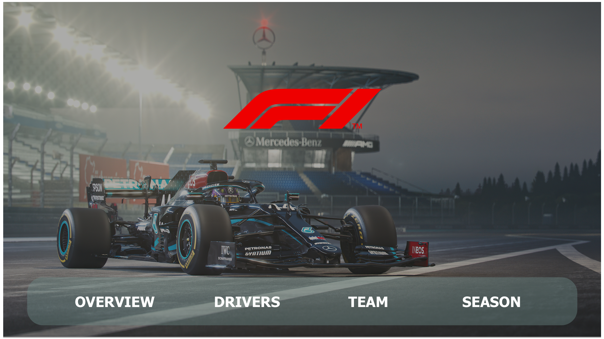
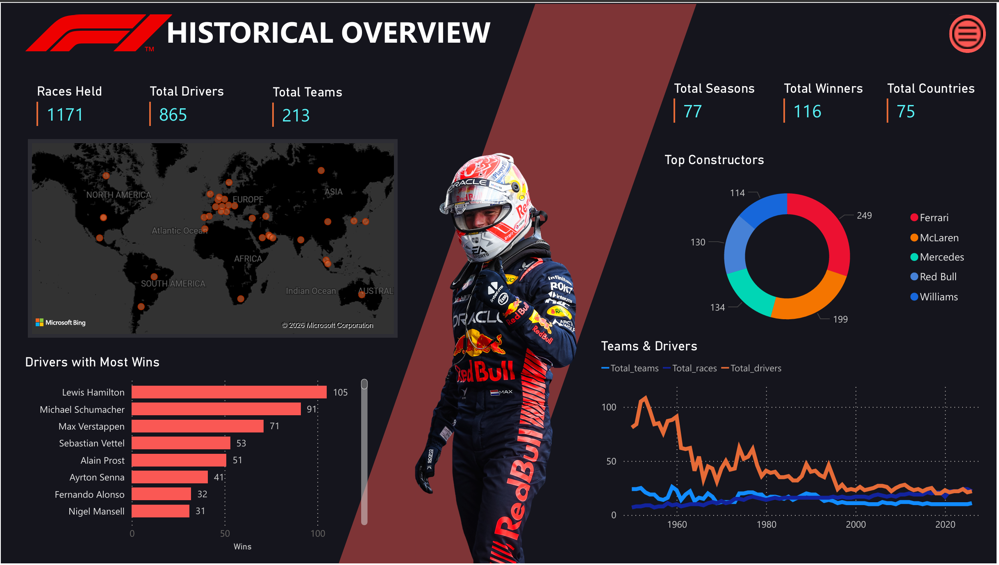
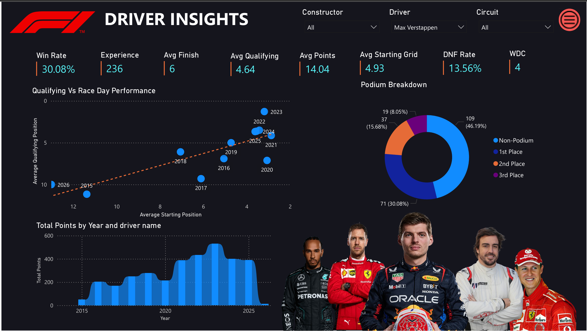
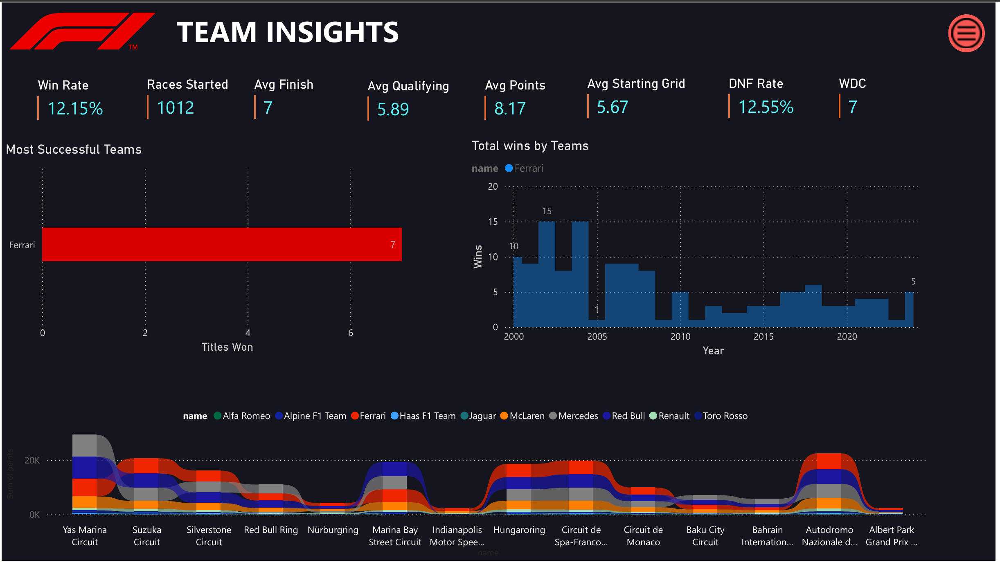
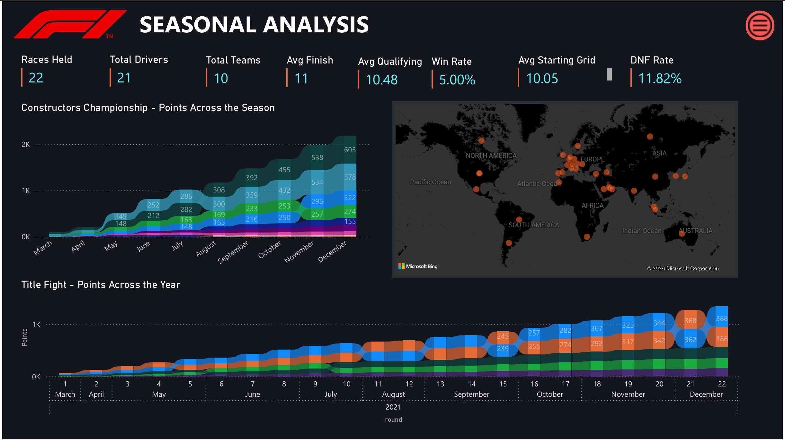

<div align="center">

# 🏁 Formula 1 Historical Analytics Dashboard

### An interactive Power BI exploration of drivers, constructors, races, and seasons across Formula 1 history.

<p>
  
  
  
  
</p>

**Built by Ajin P Joseph**

[📊 Open the Power BI file](./Formula1_dashboard.pbix) &nbsp; • &nbsp; [📄 Project report](./F1_Dashboard_Report.pptx) &nbsp; • &nbsp; [🖼️ Dashboard PDF](./Formula1_dashboard._updated.pdf)

</div>

---

## 📌 Project Overview

Formula 1 generates decades of race results, driver records, constructor histories, circuits, and championship data. This project turns that historical data into an **interactive Power BI dashboard** designed to answer questions about **who performed, which teams succeeded, and how the sport changed over time**.

The dashboard is organized into four analytical views:

| Page | Focus | What it explores |
|---|---|---|
| 🗺️ **Historical Overview** | The big picture | Races, drivers, teams, seasons, countries, all-time wins, and long-term participation trends |
| 🏎️ **Driver Insights** | Driver performance | Win rate, podium conversion, qualifying vs. race-day performance, points, experience, and DNF rate |
| 🏆 **Team Insights** | Constructor performance | Wins, championships, efficiency metrics, and circuit-specific team performance |
| 📈 **Seasonal Analysis** | Season-level storytelling | Championship points progression, race calendars, teams, drivers, and momentum across a selected season |

---

## 🖥️ Dashboard Gallery

### Landing Page

<p align="center">
  <a href="./assets/01-dashboard-home.jpg">
    
  </a>
</p>

The landing page provides navigation into the four analytical sections: **Overview, Drivers, Team, and Season**.

### The Four Analytical Pages

<table>
  <tr>
    <td width="50%" align="center" valign="top">
      <a href="./assets/02-historical-overview.jpg"></a>
      <br><strong>🗺️ Historical Overview</strong>
      <br><sub>1,171 races · 865 drivers · 213 teams · 77 seasons</sub>
    </td>
    <td width="50%" align="center" valign="top">
      <a href="./assets/03-driver-insights.jpg"></a>
      <br><strong>🏎️ Driver Insights</strong>
      <br><sub>Performance, podiums, qualifying vs. race day, points & reliability</sub>
    </td>
  </tr>
  <tr>
    <td width="50%" align="center" valign="top">
      <a href="./assets/04-team-insights.jpg"></a>
      <br><strong>🏆 Team Insights</strong>
      <br><sub>Wins, titles, efficiency metrics & circuit-specific performance</sub>
    </td>
    <td width="50%" align="center" valign="top">
      <a href="./assets/05-seasonal-analysis.jpg"></a>
      <br><strong>📈 Seasonal Analysis</strong>
      <br><sub>Championship progression, race calendar & season-level metrics</sub>
    </td>
  </tr>
</table>

> Click any dashboard image to open the full-resolution version.

---

## 🔍 What Each Page Lets You Explore

**Historical Overview** — the full dataset in one frame: all-time constructor success, drivers with the most wins, race participation over time, and the geographical footprint of Formula 1.

**Driver Insights** — interactive filtering by **constructor, driver, and circuit**, with win rate, DNF rate, race experience, world titles, qualifying position, starting grid, average finish, points, podium breakdown, and qualifying-vs-race-day analysis. The report walkthrough uses **Max Verstappen** as an example selection.

**Team Insights** — constructor-level wins, championships, race starts, win and DNF rates, qualifying and starting positions, average finish and points, plus circuit-specific performance. The report walkthrough uses **Ferrari** as an example selection.

**Seasonal Analysis** — a selected season can be explored through championship point progression, constructor progression, race calendar, geography, and seasonal performance metrics. The report walkthrough uses **2021** as its example season, with 22 races, 21 drivers, and 10 teams.

---

## 🧩 Data & Transformation

The dashboard is built from a **Kaggle historical Formula 1 dataset** containing the following core entities:

| Table / Entity | Purpose |
|---|---|
| **Drivers** | Driver name, nationality, and date of birth |
| **Constructors** | Teams competing in Formula 1 |
| **Races** | Grand Prix year, location, and circuit |
| **Results** | Central race-result fact table containing finishing position and points |
| **Circuits** | Geographical information for racetracks |

### Data Preparation

Several transformations were applied before analysis:

- Missing values represented by `\\N` were handled according to data type; numeric fields were replaced with `0`.
- Date fields were converted to proper date types for time-based analysis.
- A calculated **Full Name** column combines driver first and last names.
- A **Podium Category** classifies results as **1st, 2nd, 3rd, or Non-Podium**.

---

## 🧮 DAX Measures

The dashboard uses a custom DAX measure layer for reusable performance calculations.

```DAX
Total Races = DISTINCTCOUNT('races'[raceId])
```

```DAX
Total Wins = CALCULATE(
    COUNTROWS('results'),
    'results'[positionOrder] = 1
)
```

```DAX
Win Rate = DIVIDE(
    [Total Wins],
    [Total Races],
    0
)
```

```DAX
DNF Rate = DIVIDE(
    CALCULATE(
        COUNTROWS('results'),
        'results'[statusId] <> 1
    ),
    COUNTROWS('results'),
    0
)
```

Additional measures include **Total Drivers, Total Teams, Total Points, Total Podiums, Average Finish Position, and Average Points**.

---

## 🔎 Key Findings From the Dashboard

The dashboard surfaces several historical patterns:

**Driver dominance** — all-time wins are concentrated among a relatively small group of highly successful drivers.

**Constructor legacies** — teams such as Ferrari and Mercedes show competitive presence across multiple periods of Formula 1 history.

**Global calendar growth** — the race calendar and geographic footprint expand substantially across the historical timeline represented in the dataset.

**Season-to-season variability** — driver performance can range from sustained consistency to a strong single-season peak.

These are observations surfaced by the dashboard rather than predictions about future Formula 1 performance.

---

## 🛠️ Tools & Technologies

`Power BI Desktop` · `DAX` · `Kaggle Historical F1 Dataset`

The project focuses on **data cleaning, modeling, calculated measures, interactive filtering, time-series analysis, geographical visualization, and dashboard storytelling**.

---

## 📂 Repository Contents

```text
Formula1-dashboard/
│
├── Formula1_dashboard.pbix
├── Formula1_dashboard._updated.pdf
├── F1_Dashboard_Report.pptx
├── README.md
│
└── assets/
    ├── 01-dashboard-home.jpg
    ├── 02-historical-overview.jpg
    ├── 03-driver-insights.jpg
    ├── 04-team-insights.jpg
    └── 05-seasonal-analysis.jpg
```

The `.pbix` file contains the interactive Power BI report. The PDF provides the dashboard pages as a static visual reference, while the PowerPoint documents the project background, dataset, data preparation, DAX measures, walkthrough, findings, and conclusion.

---

## ▶️ How to Explore

1. Download **`Formula1_dashboard.pbix`** from this repository.
2. Open it in **Power BI Desktop**.
3. Start from the landing page and use the navigation buttons to move between the four analytical pages.
4. Experiment with the available driver, constructor, circuit, and season filters to explore the dataset interactively.

> **Note:** The dashboard is designed for exploration in Power BI Desktop; GitHub displays the screenshots and supporting report files as static references.

---

## 🎯 What This Project Demonstrates

This project goes beyond simply placing charts on a Power BI canvas. It demonstrates a workflow from **raw historical data → cleaning and transformation → DAX calculations → interactive analysis → visual storytelling**.

The goal was to make a large historical motorsport dataset feel approachable while still supporting deeper questions around driver performance, constructor consistency, race geography, and championship progression.

---

## 👤 Author

**Ajin Ponnahcan Joseph**  
B.Tech Civil Engineering · Minor in Information Technology

Built as a Power BI analytics project combining an interest in **Formula 1, motorsport, and data-driven visualization**.

---

<div align="center">

### 🏁 From race results to a story of Formula 1 history.

</div>
